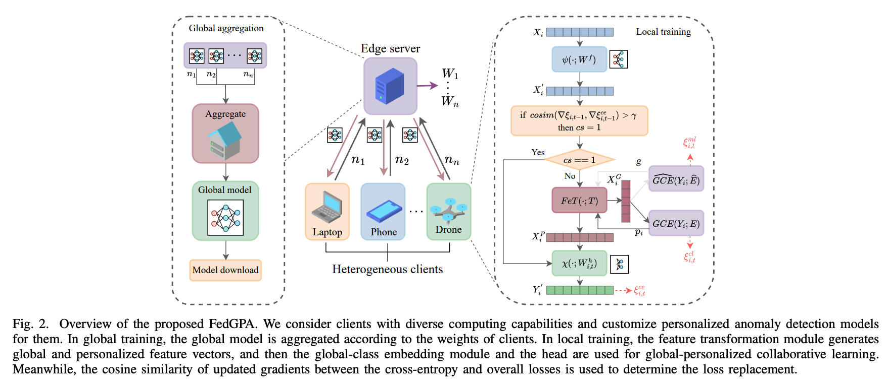
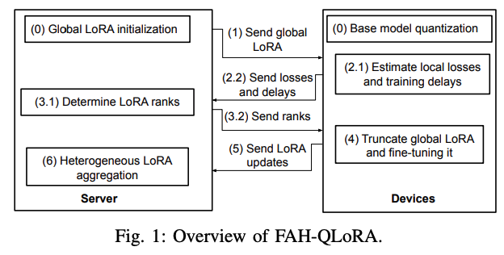

Focus: FL    

# 📚 Table of Contents

[1. FedGPA: 面向边缘异常检测的全局-个性化联邦学习框架](#FedGPA-面向边缘异常检测的全局-个性化联邦学习框架)  

# 🚀 FedGPA: 面向边缘异常检测的全局-个性化联邦学习框架  

> 📄 论文信息：IEEE INFOCOM 2025  
> 🏫 单位：福州大学 & 英国埃克塞特大学  
> ✍️ 作者：陈哲毅、薛龙翔、钟璐颖、闵革勇  

---

## 🏠 框架总览  

  
  
<em>图1：真实测试床设备拓扑</em>

> **一图读懂 FedGPA**：3 条泳道、4 个关键模块 + 1 个加速 Trick。  
> 从云到端，故事主线就是 **“双特征 → 双损失 → 梯度闸门”**。  

---

### ① 顶层：边缘服务器（Edge Server）—— *“云侧 5 秒速成班”*
- **输入**：上一轮的 `{Wf, E, T}`  
- **操作**：  
  1. 按客户端数据量 `ni` 加权聚合  
  2. 生成全局三元组 `{Wf, E, T}`，打包群发  
- **输出**：下发全局模型，进入下一轮  

---

### ② 中层：本地训练（Local Training）—— *“端侧双轨实验室”*

每个客户端（Laptop｜Phone｜Drone）本地并行 **两条流水线**：

| 流水线 | 输入 | 关键模块 | 输出 & 作用 |
|---|---|---|---|
| **Global Rail** | 原始流量 `X` → `X'` | FeT(`;T`) → `XG`   GCE(`Yi;E`) | 全局特征 `XG` 贴近“攻击共性” |
| **Personal Rail** | 同一份 `X'` | FeT(`;T`) → `XP`   轻量头 `χ(;Wh)` | 个性化特征 `XP` 专注本地细分类 |

👉 **精髓**：两条轨道共享主干 `Wf`，依靠条件参数 α/β 让数据“一份两用”。  

---

### ③ 加速开关：Cosine-Sim 闸门—— *“慢节点救生圈”*
- **计算**：`cosim(∇L_ce, ∇L_total)`  
- **判断**：  
  - `> γ (0.95)` → 打开闸门，仅用 `L_ce` 更新  
  - 否则 → 全损失精调  
- **效果**：慢节点训练时间 ↓30%+，精度几乎不降。  

---

### ④ 图标语言小贴士
- **箭头虚实**：实线=数据流，虚线=控制/参数  
- **颜色区分**：绿色=全局共享，蓝/橙=双轨特征，红色=加速触发器  
- **设备剪影**：笔记本>手机>无人机，直观展示系统异构  

---

## ✨ 一句话总结
> **“边缘聚合共性，本地保留个性，cosine 闸门救慢节点。”**  
FedGPA 解决了统计 + 系统双异构问题。  

---

## 1️⃣ 引言（Introduction）
- **业务痛点**：  
  - IoT 爆发 → 攻击面扩大，实时异常检测迫切  
  - 云集中方案 → 带宽高、时延大、隐私风险  
  - MEC 下沉 → 仍有“数据孤岛”+“隐私”难题  
- **挑战**：  
  - 统计异构：不同场景流量分布差异大  
  - 系统异构：设备算力差异 10×+，慢节点拖累全局  
- **现有方案不足**：  
  - FedAvg：单一模型，Non-IID 下精度跳水  
  - pFL（FedPer 等）：个性化过度，放弃全局协同  
- **本文立意**：  
  首次提出 **全局+个性化协同** 的边缘异常检测 FL 框架，并给出收敛保证。  

---

## 2️⃣ 相关工作（Related Work）
- **传统检测**：浅层 ML（KNN、C4.5）需手工特征；深度 DL 精度高但需集中数据  
- **联邦检测**：  
  - 直接套 FedAvg → 在 Non-IID 下失败  
  - 个性化 FL → 忽略慢节点问题  
- **结论**：需要兼顾 *统计+系统* 双异构的新框架 → FedGPA  

---

## 3️⃣ FedGPA 框架详解（Method）

### 🔹 系统模型
- 客户端数量 N，数据集 Non-IID，算力差异大  
- 每轮：下载 `{ψ, E, T}` → 本地训练 → 上传参数 → 边缘端加权聚合  

---

### 🔹 创新点
1. **FeT 条件特征变换**：一份流量 → `X_G` (全局) + `X_P` (个性化)  
2. **GCE 全局类嵌入**：引入对比损失 + 幅度损失，提升判别力&稳定性  
3. **个性化轻量头**：仅对 `X_P` 分类，适配本地特性  
4. **梯度余弦相似度加速**：慢节点仅用 `L_ce` 更新 → 降低计算负担  

---

### 🔹 算法流程（Algorithm 1）
1. 边缘端：初始化 → 聚合  
2. 客户端：接收三元组 → 双路训练 → 加速判断 → 上传更新  
3. 重复 R 轮 → 输出个性化模型  

---

## 4️⃣ 理论分析（Convergence）
- 假设：有界梯度、L-光滑、μ-强凸  
- 结论：  
  - 收敛速度 O(1/R)  
  - 损失替换策略不影响收敛性，只降低常数项  
  - **创新**：首次在边缘异构场景下给出 pFL 收敛界  

---

## 5️⃣ 实验评估（Experiments）

### ⚙️ 测试床
- 边缘服务器：RTX3090 ×2，Xeon  
- 客户端：Raspberry Pi 4B & Jetson TX2 等 10 台异构设备  

### 📂 数据集
| 名称 | 攻击类型 | 备注 |
|---|---|---|
| ACI-IOT-2023 | Recon/DoS/BruteForce/Spoofing | 家庭 IoT |
| CIC-IOT-2023 | DDoS/Mirai/Spoofing | 33 节点拓扑 |
| USTC-TFC-2016 | Virut/Neris/Htbot 等 | 早期经典 |  

👉 使用 Dirichlet(α=0.5) 采样 → **重度 Non-IID**  

---

### 📊 主要结果
| 指标 | ACI-IoT | CIC-IoT | USTC-TFC |
|---|---|---|---|
| **最高精度** | 98.67% | 97.83% | 96.04% |
| **训练时间** | 13.77s | 5.47s | 4.73s |
| **较 GPFL 提速** | ~40% | ~34% | ~30% |
| **较 FedAvg 精度提升** | +2.31pp | +19.05pp | +5.39pp |

- 扩展性：客户端数增至 50，FedGPA 精度波动 <9%（其他方法 17–43%）  
- 收敛：前 30 轮即收敛，曲线稳定  
- 超参：γ=0.95 为最优帕累托点  

---

## 6️⃣ 结论（Conclusion）
- **贡献**：  
  1. 提出首个治理“统计+系统双异构”的边缘异常检测 FL 框架  
  2. FeT + GCE + 梯度余弦加速三大核心创新  
  3. 理论收敛证明 + 真实测试床验证  
- **效果**：  
  - 时间缩短 30–40%  
  - 精度提升 2–19pp  
- **未来工作**：  
  - 芯片级异构优化（ARM/RISC-V/FPGA）  
  - 差分隐私 + 安全聚合  
  - 在线增量学习应对零日攻击  

---

## 🎯 一句话提炼
> **FedGPA 让“慢节点”也能快速共享全球攻击知识，同时保留本地流量个性。**  
真正做到：**“全局共性不丢失，本地个性不妥协”。**

# 🚀 FAH-QLoRA 精读总结  
> 📄 IEEE INFOCOM 2025 | 🏫 德州大学圣安东尼奥分校  
> 「在资源天差地别的边缘端，如何又快又省地联邦微调百亿级大模型？」  
> —— 一篇把 **“量化 + 动态 LoRA”** 做到极致的系统论文

---

## 🏗️ 框架总览

  
  
<em>图 1：真实测试床设备拓扑</em>

---

## 🔍 图 1 全景解读 —— “FAH-QLoRA 一次联邦 round 的 6 步快闪”

> 把“大模型联邦微调”拍成一部 6 幕短剧：  
> ① 量化底座 → ② 下发 → ③ 探针 → ④ 定秩 → ⑤ 截断训练 → ⑥ 零垫聚合  
> 每一步都围着 **“省内存、省时间、打散 straggler”** 转！

---

### 🎬 角色表
| 图标 | 角色 | 人设 |
|---|---|---|
| 🖥️ 灰色服务器 | **导演** | 掌控全局秩、剪辑聚合 |
| 📱 彩色设备 | **演员** | 内存/网速千差万别，台词（LoRA 秩）由导演动态分配 |

---

### 🚦 6 步分镜脚本

| 幕次 | 镜头语言 | 幕后黑科技 | 名场面 |
|---|---|---|---|
| **0️⃣** | 服务器抛出**最大秩** LoRA 矩阵，设备先对 LLM **量化瘦身**（4/8/16 bit） | 量化后 W⁰ 显存 ↓50–75%，树莓派也能跑 7B 模型 | 灰色积木，深色 = 更低比特 |
| **1️⃣** | 全局 BA 矩阵下发（绿色箭头） | 只传 LoRA 参数，通信量 < 原模型 1% | 箭头明显变细 |
| **2️⃣** | 本地“试戏”：当前秩 vs 探针秩-1 各跑小 epoch | 计算损失下降率 R | 两个橙色仪表盘对比 |
| **3️⃣** | 服务器：① 更新平均秩 r^i；② 解 MILP 分配各设备秩 r_n^i | 快卡多分，慢卡少分，wall-clock 最优 | 每台设备旁标出绿色 rank |
| **4️⃣** | 设备截断全局 BA → 只留前 r_n 列/行 → 本地训练 τ 步 | 计算量 ∝ r_n，慢节点不再拖堂 | 积木被“剪刀”裁剪 |
| **5️⃣** | 设备上传小秩 BA | 上传量 ∝ r_n，进一步省带宽 | 箭头再变细 |
| **6️⃣** | 服务器零填充补齐 → 简单平均 → 新一轮全局 BA | 兼容任意 FedAvg 变种 | 灰色补零块拼成绿色成品 |

---

### 🎯 一张图带走的核心卖点
1. **量化底座**：冻结模型压到 4–16 bit，显存 ↓44%。  
2. **探针 + 定秩**：每轮动态选出最快收敛平均秩。  
3. **截断 + 零填充**：异构 BA 无缝拼合，兼容旧聚合协议。  

> **一句话**：6 个动作片镜头 → 记住 FAH-QLoRA 如何 **“又快又省”** 把大模型塞进边缘设备！

---

# 📖 1 引言（Introduction）

### ① 背景
- GPT-4、Llama-3 等 LLM 刷新 NLP 天花板，但 **通用 ≠ 专用**。  
- 垂直场景（医疗、车载语音）仍需 **领域微调**。  
- 集中微调 → 触碰 **隐私红线**（GDPR、HIPAA 等）。

### ② 联邦学习：看似完美
- 数据不出本地，仅上传参数。  
- 但 LLM **全参数微调**在边缘不可行：  
  - 显存爆炸：LLaMA-65B FP16 ≈ 780 GB；  
  - 通信缓慢：121 GB/round，20 Mbps 上行 ≈ 14 h；  
  - 算力不足：树莓派跑 FP16 千亿矩阵乘法 = “烤机”。

### ③ PEFT（参数高效微调）来了
- **LoRA**：冻结 W⁰，只训 BA → 参数量 ↓99%。  
- 但仍有问题：  
  1. 内存：7B+LoRA 仍需 19.5 GB；  
  2. 系统异构：同秩导致 **straggler effect**。

### ④ 本文立意
提出 **FAH-QLoRA**：  
- 冻结 W⁰ 先量化 → 内存腰斩；  
- 每轮动态确定 **平均 LoRA 秩**；  
- 按设备异构分配秩，彻底打散 straggler；  
- 收敛保证 + 实验验证：时间 ↓45.86%，内存 ↓44.15%。

---

# 📚 2 前置知识（Preliminaries）

### 2.1 LoRA
- 冻结 W⁰∈ℝ^{u×v}，新增 BA，其中 B∈ℝ^{u×r}, A∈ℝ^{r×v}。  
- 参数量 ≈ 2ur，r=16 时 < 1%。  

### 2.2 量化
- 均匀量化：W_q = round((M_q / Absmax(W))·W)。  
- 推理时反量化，显存 ∝ q-bit。  
- **区别 QLoRA**：QLoRA = 单机；FAH-QLoRA = 联邦 + 异构量化 + 异构秩。  

---

# 🧮 3 问题建模（Problem Formulation）

- 系统：N 个设备，私有数据 D_n，损失 F_n(W)。  
- 目标：最小化全局损失 F(W)=1/N ∑F_n(W^0+BA)。  
- 约束：  
  - 内存 ≤ 设备上限；  
  - 每轮 wall-clock = 最慢设备时间；  
  - 数据 non-IID。  
- 决策变量：平均秩 r^i + 设备秩 r_n^i。  

---

# ⚙️ 4 FAH-QLoRA 框架设计

### 4.1 总览  
0️⃣ 量化 → 1️⃣ 下发 → 2️⃣ 探针 → 3️⃣ 定秩 → 4️⃣ 截断训练 → 5️⃣ 上传 → 6️⃣ 零填充聚合。  

### 4.2 轮级动态秩  
- 定义损失下降率 R^i = (F^{i-1}−F^i)/T^i。  
- 目标：选 r^i 最大化 R^i。  
- 策略：符号梯度在线搜索 + 边界约束。  

### 4.3 设备级异构秩  
- 单设备延迟：T_n = α_n + β_n·r_n + L(r_n)/带宽。  
- 优化：min max(T_n)，s.t. 平均秩 = r^i。  
- 解法：MILP 松弛 → CVX → 取整。  

### 4.4 截断 & 零填充  
- 设备：截断全局 BA，仅训 r_n。  
- 服务器：零填充回 r_max → 平均。  
- **兼容 FedAvg**。  

---

# 📐 5 收敛理论

- 假设：光滑、方差有界、量化无偏、异质度有界。  
- 定理：  
  1/I ∑‖∇F‖² ≤ O(1/√I) + O(ητζ²) + O(ητκ²) + O(π/τ)。  
- 动态秩不改收敛阶，仅影响常数。  

---

# 🔬 6 实验

### 6.1 设置
- 模型：DeBERTa-base / large。  
- 数据：GLUE 5 任务，non-IID。  
- 系统：4×A6000，设备三类量化（4/8/16 bit）。  

### 6.2 对标
- FedIT、Fed-PAQ-LoRA、FLASC 等。  

### 6.3 结果
| 指标 | 时间 ↓ | 内存 ↓ | 精度 |
|---|---|---|---|
| vs FedIT | **–45.86%** | –44.15% | 持平/+0.8 pp |
| vs Fed-PAQ-LoRA | –21.87% | –10% | 持平 |
| 消融 | –25% | –20% | 精度下降 |

- 收敛曲线：FAH-QLoRA 全程领先。  
- 秩轨迹：平均秩首轮 16 → 后期自动降至 6–8。  

---

# 📑 7 相关工作
| 方向 | 代表 | 差异 |
|---|---|---|
| 同质 LoRA-FL | FedIT, SLoRA | 同秩 + 无量化 |
| 异质 LoRA-FL | HetLoRA, FlexLoRA | 有异质秩，无动态轮级 & 量化 |
| FL 量化 | FedPAQ, AdaQuant | 只量化上传梯度，底座显存爆炸 |
| QLoRA | Dettmers et al. | 单机，未处理联邦异构 |

---

# ✅ 8 结论 & 未来

- **FAH-QLoRA**：量化底座 + 轮级动态秩 + 设备异构秩 → 解决 **内存 + 时延 + straggler**。  
- 实现：大模型联邦微调在 **树莓派级设备** 可行。  
- 未来：  
  1. 秩选择 + 梯度稀疏化联合优化；  
  2. 百亿模型分层量化 + 流水线并行；  
  3. 隐私增强（差分隐私 + 安全聚合）。  

---

# 🎯 一句话带走
> **FAH-QLoRA = 冻结底座量化 + 动态异构 LoRA 秩**  
> 让大模型联邦微调第一次真正跑进了 **资源天差地别的边缘世界** 🚀
