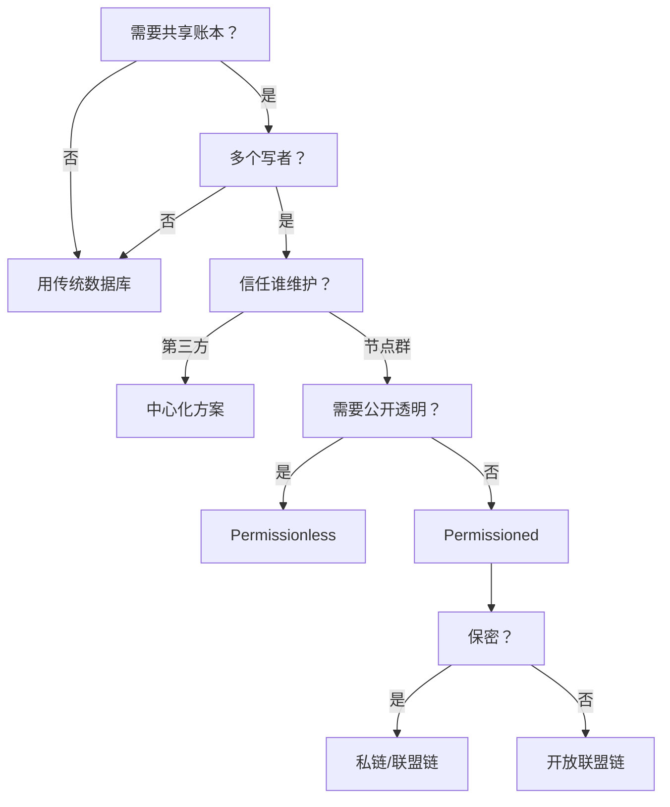

# 📅 2025-07-13 Paper Reading Log
> 今日目标：10 篇 | 实际完成：5 / 10  
Today’s Goal: 10 papers  
Focus: Blockchain Security

区块链是一种去中心化、不可篡改的分布式账本技术，能够实现多方间的数据可信共享与自动执行。

# 📚 Table of Contents

1. [1. A Vademecum on Blockchain Technologies: When, Which, and How](#1-a-run-time-framework-for-ensuring-zero-trust-state-of-clients-machines-in-cloud-environment)  
2. [2. Trust-Based Secure Multi-Cloud Collaboration Framework in Cloud-Fog-Assisted IoT](#2-trust-based-secure-multi-cloud-collaboration-framework-in-cloud-fog-assisted-iot)

# 1. A Vademecum on Blockchain Technologies: When, Which, and How
> 原文链接：https://ieeexplore.ieee.org/document/8760539  
> 作者：Marianna Belotti, Nikola Božić, Guy Pujolle, Stefano Secci  
> 期刊：IEEE Communications Surveys & Tutorials  
> 标签：#区块链综述 #DLT #共识算法 #平台选型 #使用指南

---

> ### 摘要 
区块链技术将分布式系统中的共享注册表概念应用于众多应用领域，从加密货币到任何需要在多利益相关方环境下进行去中心化、稳健、可信和自动化决策的工业系统，都将成为现实。然而，目前尚不清楚使用区块链替代任何其他传统解决方案（例如中心化数据库）的实际优势，或者至少迫切需要一本指南来指导设计人员做出正确的决策：何时采用区块链，哪种类型的区块链更能满足用例需求，以及如何使用区块链。本文旨在为社区提供这样一本指南，同时对区块链进行概述，使其超越比特币的应用范围，并综述了过去几年涌现的大量文献。我们概述了从非许可型区块链过渡到许可型区块链的关键需求及其演变，展示了拟议共识机制与实验性共识机制之间的差异，并描述了现有的区块链平台。

---

## 1 文章定位与贡献
这是一篇 **面向工程实践的“口袋书”级别综述**，系统回答 **“何时用区块链、选哪条链、怎么用”** 三大问题。  
- 覆盖 **技术演进、共识机制、平台对比、落地流程、性能权衡** 等全栈知识。  
- 提供 **决策树 + 平台选型表 + 典型案例**，可直接指导项目落地。

---

## 2 区块链概览（When 之前先理解技术）
| 关键概念 | 一句话解释 |
|---|---|
| **DLT vs Blockchain** | DLT 是“分布式账本”总称，区块链只是其中一种实现。 |
| **区块结构** | 区块头 + 交易列表 + 哈希指针，形成不可篡改链。 |
| **六性特征** | 去中心化、不可篡改、完整性、真实性、可审计、透明。 |
| **两大模式** | Permissionless（公链） vs Permissioned（联盟/私链）。 |

---

## 3 交易生命周期（懂生命周期才能“用”）
用户发起 → 签名 → 广播 → 验证 → 打包区块 → 共识 → 全网确认
- **UTXO 模型**（比特币）：现金找零思想，并行性好。  
- **Account 模型**（以太坊）：类银行账本，支持复杂状态。  
- **UTXO+ / KV 模型**：Hyperledger Fabric 等支持业务表结构。

---

## 4 共识机制全景（Which 的核心）
### 4.1 Proof-of-X 族（公链）
| 算法 | 资源 | 代表平台 | 特点 |
|---|---|---|---|
| **PoW** | 算力 | Bitcoin, Ethereum(前) | 能耗高、吞吐低、安全性强。 |
| **PoS** | 持币权益 | Ethereum 2.0, Cardano | 能耗低、富者愈富风险。 |
| **DPoS** | 投票选举 | EOS, Steem | 高性能、中心化风险。 |
| **PoET/PoI** | 可信硬件/活跃度 | Sawtooth, NEM | 适合许可环境，公平性改进。 |

### 4.2 BFT 族（联盟链）
| 算法 | 容错模型 | 通信复杂度 | 代表平台 |
|---|---|---|---|
| **PBFT** | 3f+1 容忍 f 拜占庭 | O(n²) | Fabric 默认共识。 |
| **RAFT** | 崩溃容错 | O(n) | Corda notary。 |
| **XFT/SCP** | 混合模型 | 更低 | Ripple, Stellar。 |

### 4.3 混合共识
- **ByzCoin / OmniLedger**：PoW+PBFT 委员会，兼顾开放性与一致性。  
- **Algorand**：VRF 随机抽样 + BA*，实现公链级 BFT。

---

## 5 平台选型矩阵（Which 的快查表）
| 平台 | 模式 | 共识 | 智能合约语言 | 典型 TPS | 适用场景 |
|---|---|---|---|---|---|
| **Bitcoin** | 公链 | PoW | Script（非图灵） | 3–7 | 数字黄金 |
| **Ethereum** | 公链 | PoW→PoS | Solidity | 15–40 | DeFi/NFT |
| **Fabric** | 联盟链 | PBFT/RAFT | Golang/Java | 3k–10k | 供应链 |
| **Corda** | 联盟链 | RAFT/BFT | Kotlin/Java | 数千 | 金融票据 |
| **Tendermint** | 可插拔 | BFT+PoS | Any via ABCI | 万级 | 自定义链 |
| **Quorum** | 私链 | RAFT/Istanbul | Solidity | 数百 | 企业金融 |

---

## 6 决策树（When）

---

## 7 典型用例（How）
| 场景         | 选用链             | 关键设计          |
| ---------- | --------------- | ------------- |
| **去中心化存储** | Filecoin + IPFS | 链上存哈希，链下存文件   |
| **食品溯源**   | Fabric/Sawtooth | IoT 上链 + 通道隔离 |
| **云/网络编排** | 私链+智能合约         | 指令转交易，防篡改     |

---

## 8 性能与限制
| 维度     | 公链           | 私链/联盟链      |
| ------ | ------------ | ----------- |
| **吞吐** | 10 ~ 100 TPS | 数千 ~ 万级 TPS |
| **延迟** | 分钟级          | 秒级          |
| **能耗** | 高（PoW）       | 低（BFT/RAFT） |
| **治理** | 社区治理         | 企业/联盟治理     |
---

# 2. Blockchain Meets Cloud Computing: A Survey
> 原文链接：https://ieeexplore.ieee.org/document/9076250  
> 作者：Keke Gai et al
> 期刊：IEEE Communications Surveys & Tutorials  
> 标签：#区块链 #云计算 #数据来源 #区块链即服务 #区块链服务模型

---

