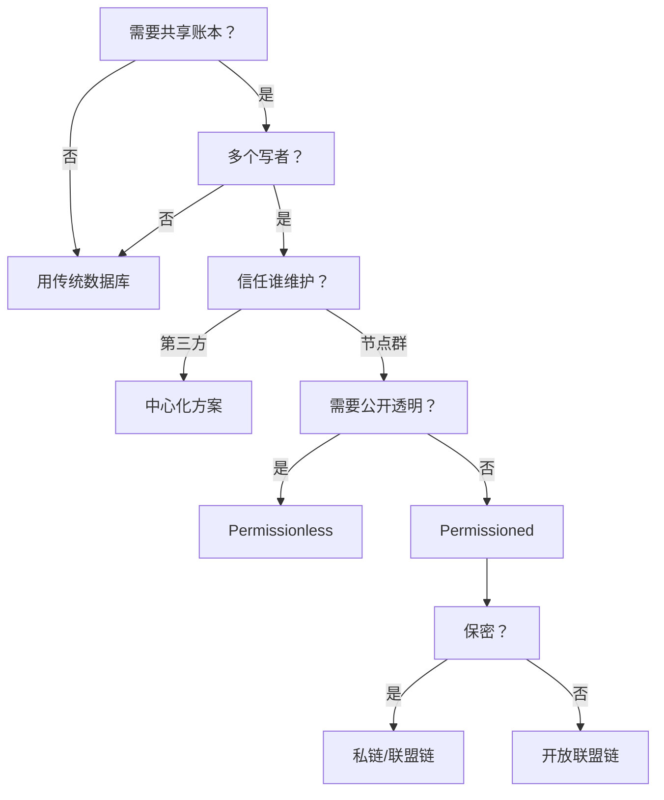

# 📅 2025-07-13 Paper Reading Log
> 今日目标：10 篇 | 实际完成：4 / 10  
Today’s Goal: 10 papers  
Focus: Blockchain Security

区块链是一种去中心化、不可篡改的分布式账本技术，能够实现多方间的数据可信共享与自动执行。

# 📚 Table of Contents

1. [1. A Vademecum on Blockchain Technologies: When, Which, and How](#1-a-vademecum-on-blockchain-technologies-when-which-and-how)  
2. [2. Trust-Based Secure Multi-Cloud Collaboration Framework in Cloud-Fog-Assisted IoT](#2-trust-based-secure-multi-cloud-collaboration-framework-in-cloud-fog-assisted-iot)  
3. [3. A Survey of Decentralizing Applications via Blockchain: The 5G and Beyond Perspective](#3-a-survey-of-decentralizing-applications-via-blockchain-the-5g-and-beyond-perspective)  
4. [4. Blockchain-Empowered Space-Air-Ground Integrated Networks: Opportunities, Challenges, and Solutions](#4-blockchain-empowered-space-air-ground-integrated-networks-opportunities-challenges-and-solutions)

# 1. A Vademecum on Blockchain Technologies: When, Which, and How
> 原文链接：https://ieeexplore.ieee.org/document/8760539  
> 作者：Marianna Belotti, Nikola Božić, Guy Pujolle, Stefano Secci  
> 期刊：IEEE Communications Surveys & Tutorials  
> 标签：#区块链综述 #DLT #共识算法 #平台选型 #使用指南

---

> ### 摘要 
区块链技术将分布式系统中的共享注册表概念应用于众多应用领域，从加密货币到任何需要在多利益相关方环境下进行去中心化、稳健、可信和自动化决策的工业系统，都将成为现实。然而，目前尚不清楚使用区块链替代任何其他传统解决方案（例如中心化数据库）的实际优势，或者至少迫切需要一本指南来指导设计人员做出正确的决策：何时采用区块链，哪种类型的区块链更能满足用例需求，以及如何使用区块链。本文旨在为社区提供这样一本指南，同时对区块链进行概述，使其超越比特币的应用范围，并综述了过去几年涌现的大量文献。我们概述了从非许可型区块链过渡到许可型区块链的关键需求及其演变，展示了拟议共识机制与实验性共识机制之间的差异，并描述了现有的区块链平台。

---

## 文章定位与贡献
这是一篇 **面向工程实践的“口袋书”级别综述**，系统回答 **“何时用区块链、选哪条链、怎么用”** 三大问题。  
- 覆盖 **技术演进、共识机制、平台对比、落地流程、性能权衡** 等全栈知识。  
- 提供 **决策树 + 平台选型表 + 典型案例**，可直接指导项目落地。

---

## 区块链概览（When 之前先理解技术）
| 关键概念 | 一句话解释 |
|---|---|
| **DLT vs Blockchain** | DLT 是“分布式账本”总称，区块链只是其中一种实现。 |
| **区块结构** | 区块头 + 交易列表 + 哈希指针，形成不可篡改链。 |
| **六性特征** | 去中心化、不可篡改、完整性、真实性、可审计、透明。 |
| **两大模式** | Permissionless（公链） vs Permissioned（联盟/私链）。 |

---

## 交易生命周期（懂生命周期才能“用”）
用户发起 → 签名 → 广播 → 验证 → 打包区块 → 共识 → 全网确认
- **UTXO 模型**（比特币）：现金找零思想，并行性好。  
- **Account 模型**（以太坊）：类银行账本，支持复杂状态。  
- **UTXO+ / KV 模型**：Hyperledger Fabric 等支持业务表结构。

---

## 共识机制全景（Which 的核心）
### Proof-of-X 族（公链）
| 算法 | 资源 | 代表平台 | 特点 |
|---|---|---|---|
| **PoW** | 算力 | Bitcoin, Ethereum(前) | 能耗高、吞吐低、安全性强。 |
| **PoS** | 持币权益 | Ethereum 2.0, Cardano | 能耗低、富者愈富风险。 |
| **DPoS** | 投票选举 | EOS, Steem | 高性能、中心化风险。 |
| **PoET/PoI** | 可信硬件/活跃度 | Sawtooth, NEM | 适合许可环境，公平性改进。 |

### BFT 族（联盟链）
| 算法 | 容错模型 | 通信复杂度 | 代表平台 |
|---|---|---|---|
| **PBFT** | 3f+1 容忍 f 拜占庭 | O(n²) | Fabric 默认共识。 |
| **RAFT** | 崩溃容错 | O(n) | Corda notary。 |
| **XFT/SCP** | 混合模型 | 更低 | Ripple, Stellar。 |

### 混合共识
- **ByzCoin / OmniLedger**：PoW+PBFT 委员会，兼顾开放性与一致性。  
- **Algorand**：VRF 随机抽样 + BA*，实现公链级 BFT。

---

## 平台选型矩阵（Which 的快查表）
| 平台 | 模式 | 共识 | 智能合约语言 | 典型 TPS | 适用场景 |
|---|---|---|---|---|---|
| **Bitcoin** | 公链 | PoW | Script（非图灵） | 3–7 | 数字黄金 |
| **Ethereum** | 公链 | PoW→PoS | Solidity | 15–40 | DeFi/NFT |
| **Fabric** | 联盟链 | PBFT/RAFT | Golang/Java | 3k–10k | 供应链 |
| **Corda** | 联盟链 | RAFT/BFT | Kotlin/Java | 数千 | 金融票据 |
| **Tendermint** | 可插拔 | BFT+PoS | Any via ABCI | 万级 | 自定义链 |
| **Quorum** | 私链 | RAFT/Istanbul | Solidity | 数百 | 企业金融 |

---

## 决策树（When）

---

## 典型用例（How）
| 场景         | 选用链             | 关键设计          |
| ---------- | --------------- | ------------- |
| **去中心化存储** | Filecoin + IPFS | 链上存哈希，链下存文件   |
| **食品溯源**   | Fabric/Sawtooth | IoT 上链 + 通道隔离 |
| **云/网络编排** | 私链+智能合约         | 指令转交易，防篡改     |

---

## 性能与限制
| 维度     | 公链           | 私链/联盟链      |
| ------ | ------------ | ----------- |
| **吞吐** | 10 ~ 100 TPS | 数千 ~ 万级 TPS |
| **延迟** | 分钟级          | 秒级          |
| **能耗** | 高（PoW）       | 低（BFT/RAFT） |
| **治理** | 社区治理         | 企业/联盟治理     |
---

# 2. Blockchain Meets Cloud Computing: A Survey
> 原文链接：https://ieeexplore.ieee.org/document/9076250  
> 作者：Keke Gai et al   
> 期刊：IEEE Communications Surveys & Tutorials  
> 标签：#区块链 #云计算 #数据来源 #区块链即服务 #区块链服务模型

---

> ### 摘要 
区块链技术被认为是以多种方式增强现有计算系统的理想选择。云计算作为一种网络赋能技术，已通过众多云服务模式在业界得到广泛应用。将区块链技术与现有云系统融合在功能/性能提升以及安全/隐私改进方面都具有巨大潜力。然而，区块链技术如何融入现有已部署的云解决方案并实现云数据中心的重构仍是一个亟待解决的问题。本研究旨在探讨这一问题，并探讨区块链与云技术融合的最新进展。本研究大致涵盖三个技术维度。首先，我们关注服务模型，并回顾了一种新兴的云相关区块链服务模型——区块链即服务 (BaaS)；其次，安全性是本研究的一个关键技术维度，并对访问控制和可搜索加密方案进行了评估；最后，我们从硬件和软件角度考察了区块链支持/参与的云数据中心的性能。本研究的主要研究结果将为未来基于区块链的云数据中心重构提供理论支持。

---

## 研究动机
- **云计算现状**：中心化架构带来信任、隐私与治理难题。  
- **区块链价值**：不可篡改、可溯源、去中心化，但落地难。  
- **研究空白**：缺乏系统梳理“如何用区块链重构云数据中心”。  
- **本文贡献**：从**服务模式、安全、性能**三大维度给出全景综述与实践指南。

---

## 研究范围一览
| 技术维度 | 覆盖主题 |
|----------|----------|
| **服务模式** | Blockchain-as-a-Service (BaaS) |
| **安全增强** | 数据溯源、访问控制、可搜索加密、去重 |
| **性能优化** | 资源调度、链下计算卸载、硬件加速、存储 |

---

## Blockchain-as-a-Service（BaaS）
### 定义与目标
- **BaaS概念**：把区块链网络/智能合约/治理工具打包成云服务。  
- **核心价值**：用户无需搭链，专注业务；云厂商负责运维、升级、安全。

### 主流产品对比
| 云厂商 | 支持链 | 特色 |
|--------|--------|------|
| Microsoft Azure | Ethereum、Corda、Fabric | 一键部署、链数据自动备份 |
| AWS | Ethereum、Fabric | 托管 EC2 模板 |
| IBM | 仅 Fabric | 安全容器、数据生命周期管理 |
| Oracle | Fabric | 物流/支付模板 |

### 开放挑战
- **跨云 BaaS**：多链、多云互操作性不足。  
- **再中心化风险**：云厂商成新“单点信任”，需 SLA 约束。  
- **新形态**：Serverless BaaS、智能合约即服务、共识即服务。

---

## 区块链驱动的数据溯源
- **痛点**：2025 年全球 175 ZB 数据，需回答“谁何时何地对我的数据做了什么”。  
- **区块链方案**：把每次数据操作写成链上不可篡改记录。  
- **代表系统**
  - **ProvChain**：私有链 + 钩子程序监控云环境事件。  
  - **SmartProvenance**：敏感数据链下存放，链上存哈希 + 投票验证。  
  - **MedShare / Nessie**：跨云医疗数据共享，违规自动吊销访问权。  
- **未来方向**：引入激励机制，奖励诚实记录、惩罚篡改。

---

## 区块链访问控制
| 传统模型 | 局限 | 区块链改进 |
|----------|------|------------|
| DAC / RBAC / ABAC | 单点失效、权限不透明、第三方不可信 | 去中心化、交易级审计、用户自主授权 |

- **典型项目**
  - **BlockSLaaS**：区块链审计日志即服务。  
  - **Zyskind 系统**：链上交易指令（Taccess）实时控制链下数据访问。  
  - **FairAccess / Novo**：智能合约颁发、转移、撤销访问令牌。  
- **待研问题**：跨云联邦场景下的统一策略、虚拟机层面访问控制。

---

## 区块链可搜索加密
- **需求**：加密数据上传云后仍能关键词检索，防止云服务商作恶。  
- **区块链角色**：
  1. 存检索索引与验证信息 → 防篡改。  
  2. 智能合约实现**公平支付**：先锁费，验证结果后自动结算。  
- **代表方案**：SearchChain、TKSE、Enigma-based OKSA。  
- **空白**：公钥可搜索加密（PEKS）与区块链结合研究不足。

---

## 区块链云去重
- **背景**：2025 年云存储 88 ZB，75 % 为重复数据。  
- **安全矛盾**：传统收敛加密可被字典攻击，且只剩单副本风险高。  
- **区块链方案**：
  - **CloudShare**：多云联盟，链上存文件指纹，链下存加密文件。  
  - **BSC + TSC 双合约**：定期挑战-应答验证文件完整性与可恢复性。  
- **关键限制**：链上冗余 vs. 去重目标冲突，目前仅作安全子系统。

---

## 区块链资源调度与计算卸载
- **场景**：PoW 挖矿、边缘计算、物联网终端算力不足。  
- **三类优化目标**  
  1. **矿工收益最大化**：ADMM 分布式卸载 + 内容缓存。  
  2. **社会福利最大化**：云/边资源拍卖，VCG 机制。  
  3. **云服务商利润最大化**：Stackelberg 博弈定价。  
- **技术融合**：深度强化学习写进智能合约，实现实时迁移决策。

---

## 云硬件加速区块链
| 硬件阶段 | 代表 | 特点 | 现状 |
|----------|------|------|------|
| CPU | 早期比特币 | 低算力、去中心化最好 | 已淘汰 |
| GPU | AMD 7970、CUDA 框架 | 并行高、功耗高 | 云矿场常用 |
| FPGA | Xilinx 定制 | 可重构、灵活 | 适合多链实验 |
| ASIC | Bitmain S19 | 算力/能效极致 | 主导市场，但算法固化风险 |

---

## 区块链存储与云结合
### 链下存储（Off-Chain）
- **方案**：链上仅存哈希或元数据，大文件放云存储 / IPFS。  
- **好处**：减轻链膨胀、提升吞吐。  
- **代表工作**：Zyskind DHT、Sun EHR、Shafagh Auditable Storage。

### 链上元数据（On-Chain Metadata）
- **问题**：纯链下方案无法防范“云内部作恶”。  
- **解决**：把**投票记录、修改历史、哈希**等关键元数据上链，实现可控可追溯。  
- **权衡**：元数据越多越安全，但链性能越低 → 未来研究热点。

---

## 主要发现与展望
| 相似性 | 连接性 | 创造性 |
|--------|--------|--------|
| 二者皆依赖分布式网络；面临类似安全威胁 | BaaS 是云对链的支撑；链反哺云信任与治理 | 互相补位：链治云之短，云补链之缺，催生 BaaS、可信云、新商业模式 |

### 关键挑战
- 跨云/跨链 BaaS 架构、通信、共识待突破。  
- 数据溯源如何锚定物理世界实体。  
- 智能合约与链基础设施安全仍需全方位加固。  
- 性能瓶颈：吞吐、能耗、存储。

### 未来研究机会
- **融合新技术**：SDN、IoT、CRAN 等与区块链-云协同。  
- **丰富 BaaS**：AI 服务、链上链下协同治理、细粒度隐私计算。  
- **高性能软硬协同**：ASIC 云、FPGA 可重构云、链原生硬件。

---

## 结论
本文从**服务模式、安全、性能**三轴出发，系统梳理了区块链如何重构云数据中心的最新进展，包括 BaaS、数据溯源、访问控制、可搜索加密、去重、资源调度、计算卸载、硬件加速及存储融合，为后续研究与产业落地提供了全景式路线图。

---

## 3. A Survey of Decentralizing Applications via Blockchain: The 5G and Beyond Perspective
- **原文链接**: [IEEE Xplore](https://ieeexplore.ieee.org/document/9548956)  
- **作者**: Kaifeng Yue et al  
- **期刊**: IEEE Communications Surveys & Tutorials  
- **标签**: #零信任 #运行时完整性 #TPM/SGX #云安全 #可扩展验证  

> ### 摘要  
可信第三方 (TTP) 常被用作应用程序中交易的发布和验证机构。基于 TTP 的范式虽然为用户带来了便利，但也带来了一系列不可避免的问题，例如安全威胁、隐私漏洞和审查制度。基于 TTP 的范式并非适用于所有现代网络，例如 5G 及更高版本的网络，这些网络正在不断发展，以支持无处不在、去中心化和自主的服务。在区块链技术愿景的推动下，应用程序的范式发生了转变，从基于 TTP 转向基于去中心化信任。基于区块链的去中心化应用程序 (DApp) 承诺无需信任权威机构，从而解决了安全和隐私问题的关键挑战。区块链研究的主要方向是探索去中心化应用程序的框架和范式，从而催生出从网络架构到商业模式的一系列全新设计。因此，本文对 5G 及未来技术视角下利用区块链实现去中心化应用的最新研究进行了简洁扼要的综述。我们提出了四大 5G 及未来技术挑战，并探讨了利用区块链实现去中心化应用的五个动机。然后，我们定义了区块链的九个基本模块，并深入解释了这些模块对去中心化的潜在影响。我们还讨论了去中心化与一些理想区块链属性之间的相互关系。特别地，我们通过回顾 5G 及未来技术的去中心化应用 (DApp)，展示了区块链在实现去中心化应用方面的能力。我们清晰地区分了三种区块链范式，并讨论了开发人员如何为 5G 及未来技术做出正确的选择。最后，我们强调了在将区块链应用于去中心化应用方面的重要经验教训和尚待解决的问题。本次综述中的经验教训和尚待解决的问题将有助于将中心化应用转化为去中心化应用。

---

## 研究背景
- 传统 **可信第三方（TTP）** 模型带来伪造、审查、回滚三大风险。  
- 5G 及后5G 网络需要 **去中心化、安全、自动化、激励友好** 的新型架构。  
- 区块链提供 **无中心化信任、不可篡改、透明** 的能力，是重构 5G 应用的关键技术。  

---

## 5G 及后5G 面临的四大挑战
| 挑战 | 具体内容 |
|---|---|
| **安全威胁** | DDoS、虚假 VNF、伪造身份、通信篡改 |
| **隐私漏洞** | 用户身份/位置/数据泄露，TTP 滥用权限 |
| **自动化管理缺失** | 多域端到端管理复杂，人工流程低效 |
| **激励机制不足** | 频谱/基础设施共享缺乏经济动力 |

---

## 区块链去中心化的五大动机
| 动机 | 描述 |
|---|---|
| **去中心化信任** | 无需 TTP，全网共识保障安全 |
| **智能合约自动化** | 自动执行协议、计费、SLA |
| **密码学隐私保护** | 零知识证明、同态加密、环签名 |
| **透明可用性** | 全网冗余，防单点故障 |
| **资产通证化** | 频谱、基础设施、数据可上链流通 |

---

## 区块链九大核心模块
> 将区块链拆成可插拔的 9 个模块，帮助开发者按需去中心化。

| 模块 | 功能 | 去中心化程度 |
|---|---|---|
| **身份管理** | 创建/验证/撤销身份 | PoW 匿名 ↔ CA 中心 |
| **程序开发** | 协议升级、开源治理 | 多方协作 ↔ 单机构封闭 |
| **数字资产创建** | 链上原生 vs 链下锚定资产 | 全节点共识 ↔ Oracle 中心 |
| **信息传播** | 交易/区块广播 | 广告式 ↔ 中继网络 |
| **区块提议** | 谁有权打包 | PoW 全网 ↔ BFT 指定 |
| **区块验证** | 交易合法性 | 全节点 ↔ 委员会 |
| **区块确认** | 最终一致性 | 概率性 ↔ 立即终局 |
| **链访问控制** | 读写权限 | 完全公开 ↔ 私有通道 |
| **链存储** | 全链数据存放 | 全节点 ↔ 链下哈希 |

---

## 区块链属性与去中心化的关系
| 属性 | 去中心化带来的权衡 |
|---|---|
| **一致性 vs 可用性** | CAP 定理：分区时必须二选一 |
| **可扩展性 vs 性能** | 节点越多，吞吐↓、延迟↑、存储↑ |
| **隐私 vs 透明** | 全公开账本 vs 加密/通道隔离 |
| **完整性 & 不可篡改** | 去中心化验证 + 数字签名 |

---

## 5G 及后5G 去中心化应用（DApp）全景
| 场景 | 区块链作用 | 代表案例 |
|---|---|---|
| **频谱管理** | 动态共享、通证激励、隐私拍卖 | Spass, TrustSAS, BSS |
| **网络切片** | 切片交易、SLA 自动执行、可信经纪 | Slice Broker Ledger |
| **认证与密钥协商** | 去中心化身份、证书撤销、密钥托管 | BAA, BTA |
| **网络编码安全** | 防止污染攻击、MAC 标签链上验证 | SECRET Small Cells |
| **基础设施共享** | 众包基站、漫游结算、自动分账 | Crowd-Cell, Roaming Chain |

---

## 三大区块链范式
| 范式 | 特点 | 适用 5G 场景 |
|---|---|---|
| **公有链（Permissionless）** | 匿名、开放、高冗余 | 频谱共享市场 |
| **私有链（Private）** | 单一机构控制、高性能 | 单一运营商内网管理 |
| **联盟链（Consortium）** | 部分去中心、已知成员、BFT | 运营商联盟认证、网络编码 |

> 文章通过 5G 具体用例（频谱、认证、编码）示范了如何根据需求选择范式。

---

## 经验与开放挑战
| 维度 | 关键要点 |
|---|---|
| **中心化/去中心化平衡** | 微服务拆分 + 9 模块灵活组合 |
| **计算范式** | 云/边/端协同，边缘节点承载链 |
| **实时性** | 读写延迟优化：链下缓存 + BFT 快共识 |
| **经济模型** | 通证激励 vs 会员费 vs 政府补贴 |
| **共识算法** | 开放网络 BFT、可扩展 PoS、混合协议 |

---

## 结论
区块链为 5G 及后 5G 提供了 **从“可信第三方”到“可信代码”** 的范式迁移。  
通过九大模块的**可插拔去中心化设计**，可构建 **安全、自动、激励友好** 的新一代无线网络。  
未来需在 **性能、成本、治理、合规** 之间持续优化，实现真正的 **去中心化 5G 生态**。

---

## 4. Blockchain-Empowered Space-Air-Ground Integrated Networks: Opportunities, Challenges, and Solutions
- **原文链接**: [IEEE Xplore](https://ieeexplore.ieee.org/document/9631953)  
- **作者**: Kaifeng Yue et al  
- **期刊**: IEEE Communications Surveys & Tutorials  
- **标签**: #零信任 #运行时完整性 #TPM/SGX #云安全 #可扩展验证  

> ### 摘要  
由于服务覆盖范围和容量有限，地面网络面临着严重的成本效率低下和难以随时随地提供无缝服务的挑战，尤其是在极端天气或热点区域（例如灾区、山区和海洋）。由太空、空中和地面层组成的多维网络的融合有望为数十亿用户和互联智能设备提供经济高效且无处不在的物联网 (IoT) 服务。在天地物联网 (SAG-IoT) 中，跨不同网络段的自主数据收集、交换和处理，以及最少的人为干预，可以为消费者带来极大的便利，然而，它也面临着来自入侵者的新型攻击。严重的隐私侵犯、可靠性问题和安全漏洞可能会阻碍 SAG-IoT 的广泛部署。新兴的区块链凭借其去中心化、透明性、不可篡改、可追溯性和可审计性的突出特性，在解决 SAG-IoT 的安全问题方面拥有巨大的潜力。尽管区块链赋能的 SAG-IoT 具有诸多优势，但由于 SAG-IoT 的固有特性（例如异构性、时变性和互操作性差）以及现有区块链方法的局限性（例如容量和可扩展性），在效率和监管方面仍存在一系列根本性挑战。本文对区块链技术集成用于保护 SAG-IoT 应用进行了全面的概述。具体而言，我们首先讨论 SAG-IoT 系统的架构、特性和安全威胁。然后，我们重点介绍基于区块链的 SAG-IoT 安全解决方案。接下来，我们讨论将区块链集成到 SAG-IoT 安全服务中时面临的关键挑战，并回顾最新的解决方案。我们将进一步探讨区块链在人工智能和 5G 网络之外的机遇，并为构建未来区块链赋能的 SAG-IoT 系统提供开放的研究方向。

> **一句话总结**  
> 空天地一体化物联网（SAG-IoT）想“全球无缝、随需接入”，但受限于**异构、移动、资源紧缺与安全隐患**；区块链凭“去中心化+不可篡改+智能合约”成为天然信任基座，却必须**量身定制**才能落地。本文系统梳理了**威胁→区块链对策→挑战→前沿方向**。

---

## SAG-IoT 是什么？  
| 层级   | 代表节点           | 关键特征 & 痛点 |
|--------|--------------------|-----------------|
| 天基   | LEO/GEO 卫星、星座 | 广覆盖、高时延、链路不稳定 |
| 空基   | 无人机/气球/飞艇   | 机动灵活、能量受限、易受劫持 |
| 地基   | 5G/6G、NB-IoT、VANET | 高速、热点拥塞、易被灾害摧毁 |

---

## 五大安全威胁全景图  
1. **数据类**  
   - 伪造/篡改传感数据 → 决策错误  
   - 隐私泄露（个人轨迹、健康信息）  

2. **身份类**  
   - 节点冒充、Sybil、身份盗用 → 内网渗透  

3. **通信类**  
   - DoS、选择性转发、网络分区 → 服务中断  

4. **服务类**  
   - 恶意固件、假充电桩、资源欺诈 → 经济损失  

5. **治理类**  
   - 行为无法溯源、GDPR 合规难 → 法律风险  

---

## 区块链如何对症下药  
| 区块链特性 | 在 SAG-IoT 中的映射 | 典型场景示例 |
|------------|----------------------|--------------|
| 去中心化共识 | 消除单点故障（SPoF） | 卫星-地面融合网络抗毁通信 |
| 不可篡改账本 | 数据/固件/电量交易追溯 | 无人机群充电结算、灾后救援数据 |
| 智能合约 | 自动执行策略 | 动态频谱拍卖、隐私访问授权 |
| 代币激励 | 鼓励节点共享资源 | 车载雾计算算力交易 |
| 匿名身份 | 隐私保护身份认证 | 跨域卫星互联网匿名接入 |

---

## 学术与工业落地案例速查  
| 网络场景 | 典型论文 / 项目 | 亮点 |
|----------|-----------------|------|
| 天-地网络 | Sun et al.「多链架构」 | 天链(卫星 BFT) + 空链(无人机 BFT) + 地链(DPoS) |
| 空-地网络 | Xu et al.「UAV 数据收集」 | 区块链维护机载账本，预测模型减少能耗 |
| 车联网 | Chen et al.「IoV 数据交易」 | 双拍卖+区块链，防止虚假报价 |
| 工业物联网 | Liu et al.「LightChain」 | 轻量级 PoW，边云协同共识 |
| 产业方案 | WaltonChain、Power Ledger | 供应链溯源、P2P 绿电交易 |

---

## 区块链落地 SAG-IoT 的六大挑战  
| 挑战 | 具体表现 | 最新缓解思路 |
|------|----------|--------------|
| **资源瓶颈** | 卫星/Raspberry Pi 跑不动 PoW | 轻节点、DAG、边缘分载 |
| **吞吐/扩展** | 比特币 7 TPS vs. 物联网万级 TPS | 分片、链下闪电网络、Bitcoin-NG |
| **安全脆弱** | 51% 攻击、合约重入 | 声誉驱动共识、AI 漏洞检测 |
| **三难困境** | 去中心化-安全-扩展无法兼得 | 混合链（联盟+私有）按需切换 |
| **隐私风险** | 链上数据公开、GDPR 不合规 | ZKP、TEE、链下加密存储 |
| **法律监管** | 匿名犯罪、跨境数据合规 | 可监管区块链、法规即合约 |

---

## 未来研究方向展望  
1. **网络切片 + 区块链**  
   - 利用智能合约自动出租/切换切片，防止 MNO 欺诈  
2. **SDN + 区块链**  
   - 用链上共识同步全局流表，解决 SDN 控制器单点隐患  
3. **边云协同 + 区块链**  
   - 链上市场撮合边缘算力与卫星回传，实现“算随星动”  
4. **AI + 区块链**  
   - 联邦学习梯度上链，既防篡改又防成员“偷懒”  
   - AI 自动调参区块大小、共识阈值，适应动态拓扑  
5. **跨链/侧链**  
   - 车辆从“城市链”驶入“卫星链”时无缝迁移身份与资产  

---

## 结论速记  
- SAG-IoT 需要“可信、可扩展、合规”的底座 → **区块链是答案，但不是现成答案**。  
- 未来工作必须**跨学科**：通信+密码+AI+法律，一起把区块链削足适履，才能穿上 SAG-IoT 这只“水晶鞋”。

